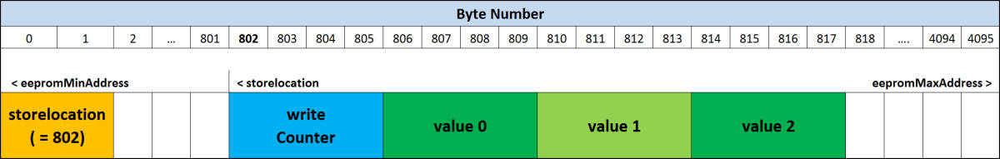

# eeprom-counter-library 

**Library to store values on the non volatile Arduino EEPROM memory.**

The ATmega328 microcontroller chip which is used on the Arduino Nano/Uno boards has an internal EEPROM storage of 1024 bytes.

The ATmega2560 microcontroller chip of the Arduino Mega has 4096 bytes of EEPROM storage.

This storage can be used to store values permanently.
This can be very usefull if you want to realize a cycle counter or store some settings you made during board operation.

It is not recommended to store new values every loop because the EEPROM has "only" a specified lifetime of 100,000 write/erase cycles.

The library manages the storage of long values to the EEPROM, it updates values that have been changed, and reads them after restart/reset of the Board.

To wear of the memory evenly, every 10,000 write cycles the location of the values will be changed automatically.

In the example code "eeprom_example_code", the possible commands of the library are listed, an their effect can be viewed in the serial print window.

Library Functions
-----------------

	// CREATE AN INSTANCE OF THE LIBRARY CLASS:
	EEPROM_Counter example_counter; 

	// IN THE SETUP LOOP, SET UP THE COUNTER:
	example_counter.setup(int eeprom_min_address, int eeprom_max_address, int number_of_values);
	// to use the whole eeprom memory, set the min address to zero, and
	// the max address to the boards eeprom size-1.

	// SET ALL STORED VALUES ZERO:
	example_counter.set_all_zero();

	// COUNT ONE UP:
	example_counter.count_one_up(number_of_the_counter);

	// SET COUNTER TO A VALUE:	
	example_counter.set(number_of_the_counter, value_to_be_stored);
	// will only write if the value is new

	// READ STORED VALUE FROM EEPROM:
	long stored_value = example_counter.get_value(number_of_the_counter);
  
	// PRINT OUT WHAT HAPPENS ON THE EEPROM
	example_counter.print_debug_information();	
 
  **An example of how the functions can be used can be found in the example code.**	

Installation
------------
The Library can be installed by cloning or downloading it to Arduinos default library location, e.g. user/documents/Arduino/libraries/.

